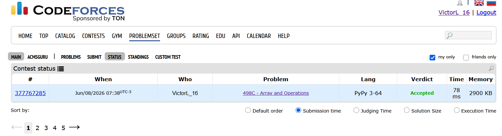

# Codeforces 498C - Array and Operations

**Link do Problema:** [https://codeforces.com/problemset/problem/498/C](https://codeforces.com/problemset/problem/498/C)

**Link da Apresentação:** [https://www.canva.com/design/DAHLhuOOSs4/fhZRprSqbRUKflnzzPK8Ag/view?utm_content=DAHLhuOOSs4&utm_campaign=designshare&utm_medium=link2&utm_source=uniquelinks&utlId=ha341ba3a8ab](https://www.canva.com/design/DAHLhuOOSs4/fhZRprSqbRUKflnzzPK8Ag/view?utm_content=DAHLhuOOSs4&utm_campaign=designshare&utm_medium=link2&utm_source=uniquelinks&utlId=ha341ba3a8ab)

**Integrantes do Grupo:**
- Victor Lins
- Gabriel de Sousa
- Lorenzo Barros

**Linguagem Utilizada:** Python

## Como Executar

A partir da raiz do projeto, você pode enviar o arquivo de texto com os casos de teste direto para o código através do redirecionamento no terminal:

```bash
# No Linux/Mac ou no Prompt de Comando (Windows):
python src/main.py < dados/entradas_do_problema.txt

# No PowerShell (Windows):
Get-Content dados\entradas_do_problema.txt | python src\main.py
ou
cat dados\entradas_do_problema.txt | python src\main.py
```

## Modelagem da Rede de Fluxo

A solução foi modelada como um problema de fluxo máximo em um grafo bipartido. A chave do problema é maximizar divisões por fatores em comum. Por isso, não usamos os números inteiros do array original como vértices da rede, mas sim os seus **fatores primos**. O fato de a regra de pareamento exigir que a soma dos índices $i + j$ seja ímpar divide naturalmente os índices disponíveis em dois conjuntos: pares e ímpares.

### Definição de Origem, Sorvedouro, Vértices, Arestas e Capacidades

- **Vértices da Rede:** Cada fator primo presente na fatoração de um número do array se torna um vértice único.
- **Origem (S):** Vértice `0`. 
- **Sorvedouro (T):** Vértice `1`. 
- **Arestas e Capacidades:**
  - **De $S$ para índices Pares:** Criamos arestas direcionadas da Origem para os vértices derivados de índices pares. A capacidade da aresta é igual ao expoente desse fator primo.
  - **De Índices Ímpares para $T$:** Criamos arestas direcionadas dos vértices ímpares para o Sorvedouro. A capacidade também é igual ao expoente do fator primo do lado direito.
  - **Entre pares válidos (Meio da rede):** Conectamos o vértice do índice Par ao vértice do índice Ímpar caso eles representem o mesmo fator primo. A capacidade aqui é infinita (`INF = 10**15`), pois o gargalo de divisões possíveis é natural e estruturalmente ditado pelas capacidades nas extremidades da rede (Origem e Sorvedouro).

## Algoritmo Utilizado


Foi utilizado o algoritmo de **Edmonds-Karp** para encontrar o fluxo máximo. Essa abordagem foi preferida no lugar do Ford-Fulkerson com DFS para garantir a localização do caminho aumentante com o menor número de arestas a cada iteração (usando BFS). Para a implementação eficiente desta busca em largura, utilizamos a estrutura de fila `deque` (Double-Ended Queue) nativa da biblioteca `collections` do Python, que garante operações de inserção e remoção em $O(1)$. Isso nos livra de casos degenerados de pior cenário e deixa o tempo de execução previsível, prevenindo o risco de *Time Limit Exceeded* (TLE).

### O Papel do Grafo Residual


A cada caminho aumentante encontrado do Source ao Sink pela nossa BFS, o fluxo daquele caminho restringe a capacidade das arestas diretas na mesma proporção em que aumenta a capacidade em arestas reversas. Isso permite ao algoritmo "desfazer" ou "redirecionar" rotas alocadas previamente se houver um caminho que otimize o fluxo total ao final.

### Conversão do Fluxo na Resposta


O valor direto do fluxo máximo capacitado que atinge o Sorvedouro equivale exatamente ao número máximo absoluto de operações possíveis. Portanto, assim que a rede esgota os caminhos aumentantes, nós apenas imprimimos a soma de todos os fluxos parciais obtidos, sem a necessidade de processamentos adicionais.

## Análise de Complexidade

A complexidade de tempo total da solução é dominada por duas etapas principais: a fatoração dos números e o cálculo do fluxo máximo em si.

1. **Fase de Fatoração:** Para cada um dos $n$ números da entrada, a busca por fatores primos itera no máximo até a raiz quadrada do número. O custo total desta fase é $O(n \sqrt{\max(a_i)})$.
2. **Fase de Fluxo Máximo (Edmonds-Karp):** A complexidade teórica é $O(V \cdot E^2)$. Analisando os parâmetros da rede neste problema:
   - O número máximo de vértices ($V$) corresponde à Origem, ao Sorvedouro e aos nós criados para os fatores primos. Como um número $a[i] \le 10^9$ possui no máximo 10 fatores primos distintos, teremos, no pior caso, em torno de $10 \cdot n + 2$ vértices. Com $n \le 100$, $V \approx 1000$.
   - O número de arestas ($E$) é derivado das ligações entre $S$ e os índices pares, as ligações dos índices ímpares para $T$, e as conexões geradas pelos fatores primos compartilhados nos $m$ pares da entrada ($m \le 100$). A rede é muito pouco densa.

Como o número de vértices e arestas gerados é muito pequeno, a complexidade temporal real roda bem abaixo do tempo limite de 1 segundo imposto pelo Codeforces. Em relação ao consumo de memória (complexidade espacial de $O(V + E)$), a estrutura dominante é a lista de dicionários (`graph = [{} for _ in range(num_nodes)]`) que armazenou as capacidades das arestas e do grafo residual. Usar dicionários no lugar de uma matriz de adjacência (que exigiria $O(V^2)$, ex: 1000x1000) foi a melhor decisão para economizar memória, dada a esparsidade do grafo.

## Casos Especiais Relevantes

Durante a implementação e modelagem, os seguintes cenários exigiram atenção:
- **Pares inválidos ou sem divisores comuns:** Caso o problema informe conexões válidas, mas os números pareados não compartilhem nenhum fator primo, a nossa implementação filtra as conexões cruzando as chaves através de intersecções (`set.intersection`). Assim, arestas irrelevantes nem chegam a ser criadas. A busca rodará uma única vez sem encontrar $T$, o fluxo máximo permanecerá `0` na primeira rodada e o programa será encerrado rapidamente.
- **Capacidades Infinitas e Estouro Numérico:** As arestas intermediárias recebem capacidade `10**15` para sinalizar uma "passagem livre" de fluxo, garantindo que o gargalo real venha dos limites estabelecidos por $S$ e $T$. Como escolhemos trabalhar em Python, que gerencia inteiros com precisão arbitrária, evitamos completamente a preocupação de um "estouro numérico" (*overflow*), um erro bem comum ao adotar esse modelo em linguagens de tipagem estática (como C++ e Java) onde se esqueceria de usar variáveis `long`.
- **Otimização para Primos Grandes:** Na fatoração, em vez de testar divisões até $10^9$, o código itera apenas até a raiz quadrada do número ($\sqrt{a[i]}$). Se ao final restar um valor superior a 1, sabemos que ele é um primo. Isso lidou elegantemente com um potencial cenário de limite de tempo estourado (*TLE*) se o array contivesse números primos enormes.

## Comprovação de Accepted


